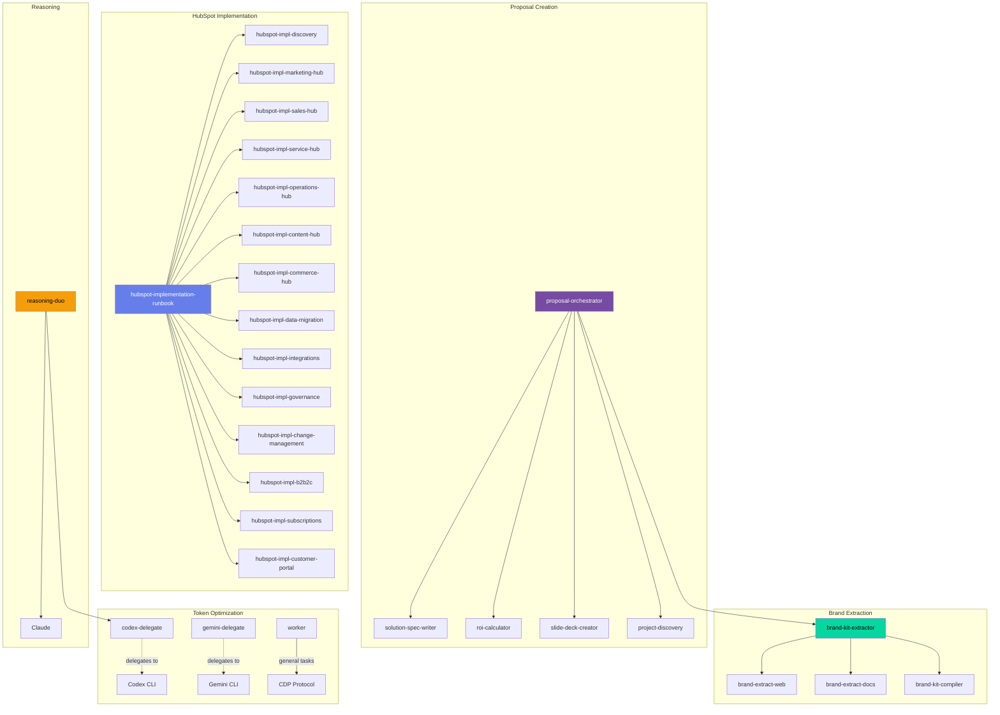
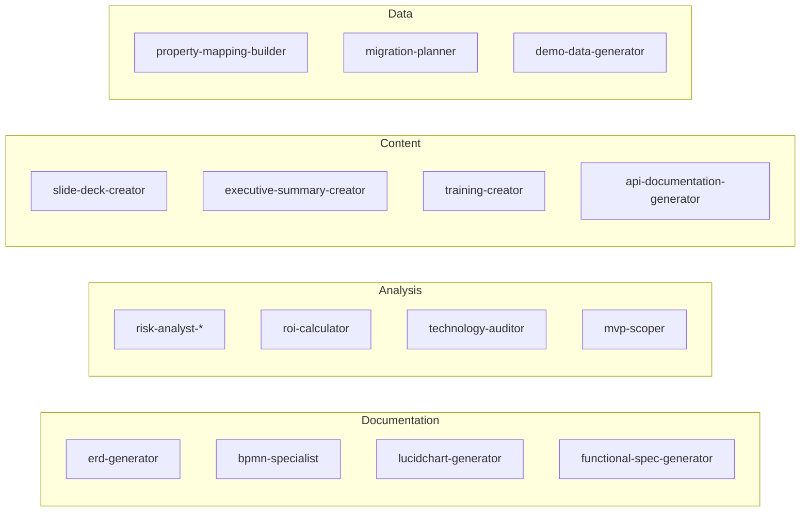
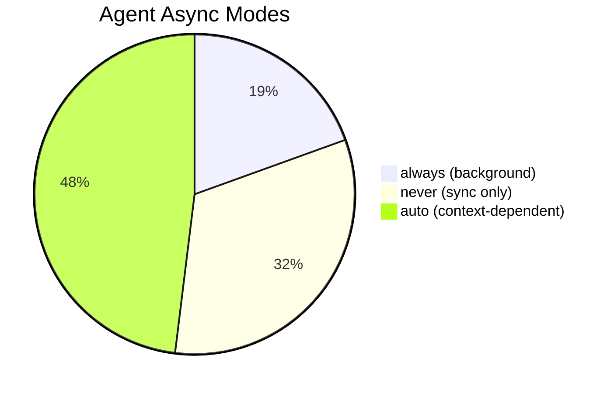

# Agent Dependency Graph

> Auto-generated visualization of agent orchestration and delegation patterns.

## Orchestrator Agents

These agents coordinate multiple sub-agents:



## Utility Agents

These agents are called by multiple orchestrators:



## Agent Categories by Model

| Model | Agents | Use Case |
|-------|--------|----------|
| **Opus** | solution-architect, reasoning-duo | Complex architecture, multi-system design |
| **Sonnet** | Most implementation agents | Code, specs, detailed analysis |
| **Haiku** | Explore agents, meeting-indexer, worker | Quick lookups, bulk processing |

## Async Mode Distribution



## Call Patterns

### Sequential Chain
```
User Request
    → discovery-audit-analyzer
    → solution-spec-writer
    → erd-generator
    → deliverable-reviewer
    → Final Output
```

### Parallel Fan-Out
```
User Request
    → brand-extract-web ─────┐
    → brand-extract-docs ────┼─→ brand-kit-compiler
    → image analysis ────────┘
```

### Hub-and-Spoke
```
hubspot-implementation-runbook (Hub)
    ├─→ discovery
    ├─→ marketing-hub
    ├─→ sales-hub
    ├─→ service-hub
    └─→ ... (13 more spokes)
```

## Key Dependencies

| Agent | Requires | Optional |
|-------|----------|----------|
| `proposal-orchestrator` | `solution-spec-writer`, `roi-calculator` | `brand-kit-extractor`, `slide-deck-creator` |
| `brand-kit-extractor` | `brand-extract-web` OR `brand-extract-docs` | `brand-kit-compiler` |
| `reasoning-duo` | `codex-delegate` | - |
| `hubspot-implementation-runbook` | `hubspot-impl-discovery` | All other hub agents |

## CDP Workspace Flow

All delegated agents follow the Cognitive Delegation Protocol:

```
PRIMARY CONVERSATION
    │
    │ 1. Creates HANDOFF.md
    │
    ├────────────────────────► SUB-AGENT WORKSPACE
    │                              │
    │                              │ 2. Executes task
    │                              │
    │                              │ 3. Writes OUTPUT.md
    │                              │
    │ ◄────────────────────────────┘
    │
    │ 4. Reads OUTPUT.md (summary only)
    │
    ▼
CONTINUES WITH RESULTS
```

## Agent Count by Domain

| Domain | Count | Examples |
|--------|-------|----------|
| HubSpot Implementation | 15 | hubspot-impl-*, hubspot-specialist |
| Documentation | 12 | functional-spec-generator, erd-generator, bpmn-specialist |
| Analysis | 8 | risk-analyst, roi-calculator, technology-auditor |
| Token Optimization | 3 | codex-delegate, gemini-delegate, worker |
| Brand | 3 | brand-kit-extractor, brand-extract-web, brand-extract-docs |
| Commercial | 5 | commercial-analyst-*, 80-20-recommender |
| Other Specialized | 31 | Various domain-specific agents |

**Total: 77 agents**

---

*Last updated: 2026-01-15*
*Regenerate with: `~/.claude/scripts/generate-agent-graph.sh`*
