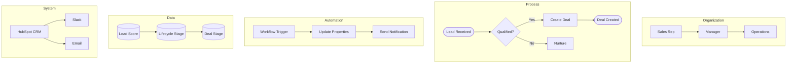

# Solution Architect Deliverable Templates

## ERD Template (Mermaid)

---

## BPMN Template (5 Swimlanes)

---

## Integration Architecture Template

---

## Options Comparison Template

| Criteria | Option A: [Name] | Option B: [Name] | Option C: [Name] |
|----------|------------------|------------------|------------------|
| **Description** | Brief summary | Brief summary | Brief summary |
| **Pros** | - Pro 1 - Pro 2 | - Pro 1 - Pro 2 | - Pro 1 - Pro 2 |
| **Cons** | - Con 1 - Con 2 | - Con 1 - Con 2 | - Con 1 - Con 2 |
| **Effort** | Low/Med/High | Low/Med/High | Low/Med/High |
| **Timeline** | X weeks | X weeks | X weeks |
| **Cost** | $X - $Y | $X - $Y | $X - $Y |
| **Risk Level** | Low/Med/High | Low/Med/High | Low/Med/High |
| **Recommendation** | | **Recommended** | |

---

## Risk Register Template

| ID | Category | Risk Description | Likelihood | Impact | Severity | Mitigation | Owner |
|----|----------|------------------|------------|--------|----------|------------|-------|
| R1 | Technical | Description | H/M/L | H/M/L | Critical/High/Med/Low | Action plan | Name |
| R2 | Timeline | Description | H/M/L | H/M/L | Critical/High/Med/Low | Action plan | Name |
| R3 | Scope | Description | H/M/L | H/M/L | Critical/High/Med/Low | Action plan | Name |
| R4 | Resource | Description | H/M/L | H/M/L | Critical/High/Med/Low | Action plan | Name |

---

## SOW Section Outline

1. **Executive Summary** (1 paragraph)
2. **Background & Context** (current state, pain points)
3. **Scope of Work**
   - In-Scope (explicit list)
   - Out-of-Scope (explicit list)
4. **Deliverables** (table with descriptions)
5. **Timeline & Milestones** (Gantt or table)
6. **Assumptions** (numbered list)
7. **Dependencies** (what we need from client)
8. **Governance**
   - Project Team & RACI
   - Meeting Cadence
   - Change Control
9. **Investment & Payment Terms**
10. **Terms & Conditions**

---

## Property Mapping Template

| Source System | Source Field | Target System | Target Field | Transformation | Validation | Notes |
|---------------|--------------|---------------|--------------|----------------|------------|-------|
| Zoho CRM | account_name | HubSpot | company_name | None | Required | SSOT |
| Zoho CRM | annual_revenue | HubSpot | annualrevenue | USD→EUR | > 0 | |
| Zoho CRM | lead_status | HubSpot | lifecyclestage | Mapping Table | In list | See Appendix A |

---

## Discovery Questionnaire Section Headers

1. **Project Context & Goals** (why, what, success metrics)
2. **Current State Assessment** (systems, data, pain points)
3. **Stakeholders & Governance** (who, decision process)
4. **Data Architecture** (objects, relationships, volumes)
5. **Integration Requirements** (systems, sync patterns)
6. **Marketing Requirements** (campaigns, automation)
7. **Sales Requirements** (pipeline, quoting)
8. **Service Requirements** (support, ticketing)
9. **Reporting & Analytics** (dashboards, KPIs)
10. **Timeline & Budget** (constraints, phases)

---

## Executive Presentation Slide Structure

1. **Title Slide** (project name, date, presenter)
2. **Agenda** (what we'll cover)
3. **Current State** (pain points, challenges)
4. **Vision** (target state, benefits)
5. **Solution Overview** (high-level architecture)
6. **Key Capabilities** (2-3 slides on features)
7. **Timeline** (phases, milestones)
8. **Investment** (costs, ROI)
9. **Risks & Mitigations** (top 3-5 risks)
10. **Next Steps** (actions, owners, dates)
11. **Q&A**
